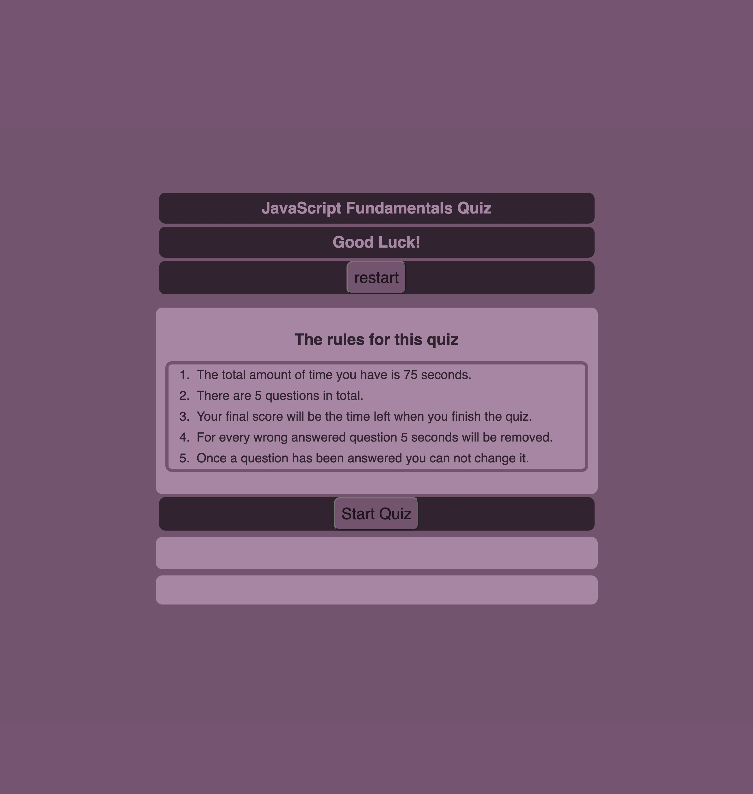
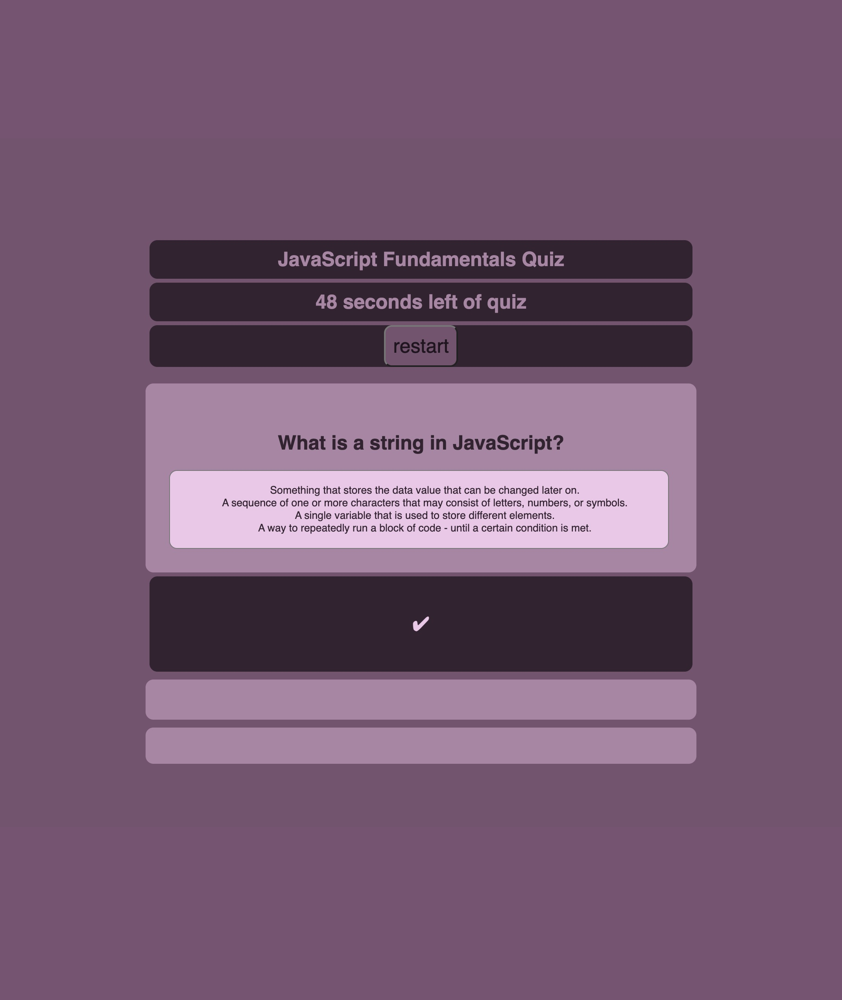
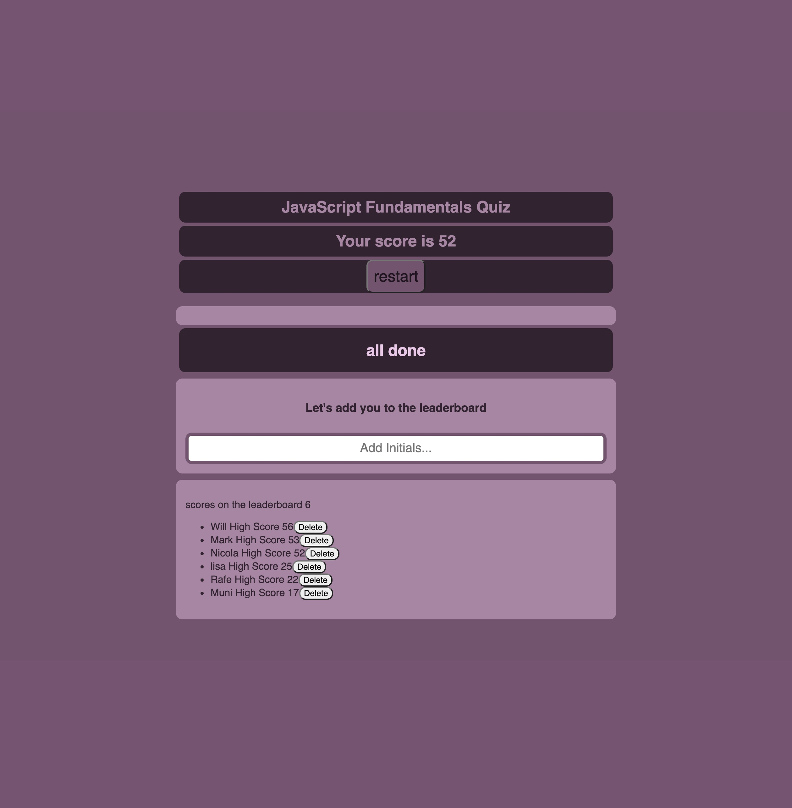

# Code-Quiz

In this project I created a timed quiz on JavaScript fundamentals that stores high scores.
The purposes of this was to produce a clean, polished and responsive user interface, through writing dynamically updated HTML and CSS powered by JavaScript code. 

## Criteria that I met to achieve this

* When the user clicks the start button a timer starts and they are presented with the a question.
* When the user answers a question they are presented with another question.
* When the user answers it incorrectly then time is subtracted from the clock.
* When the user has answered all of the questions the timer reaches 0 and the game is over.
* When the user has finished the game they can save their initials and score on the leader board.

## Deployed Application

### Before Starting the Quiz

### During the Quiz

### The Leader Board after the Quiz

[Link to Deployed Application](https://lisacr01.github.io/Code-Quiz/)

